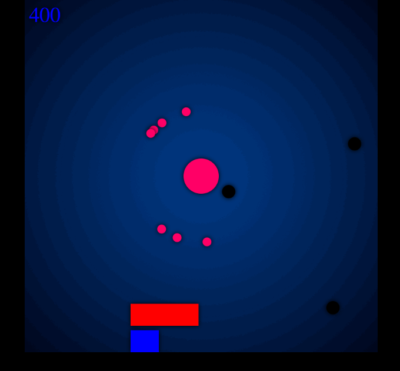

# orbo


[OrbO live][github]
[github]: http://alexpoe.tech/orbo



OrbO is a simple, JavaScript browser game where the goal is to protect your orb in the middle of the screen by using smaller orbs to destroy oncoming enemies.


## Instructions

The goal of the game is to get the highest score possible.  When you begin the game, there is an orb in the center of the screen.  You most protect this orb from oncoming enemies.  You do this by pressing the space bar to release smaller orbs.  You click on these orbs and drag them in the direction of the enemies and release your mouse click to fling them.  There is a life bar and an orb timer bar.  The orb timer bar refills throughout the game and lets you know when you can generate more orbs by pressing the space bar.  The life bar does not regenerate.  When you lose all of your life, you lose the game.

## Technical Implementation Details

Orbo is written with JavaScript, HTML and CSS.  Apart from the start page and game over page, Orbo uses HTML5's Canvas element to render all of the images:

```javascript
GameView.prototype.animate = function (time){
  var timeDelta = time - this.lastTime;

  this.game.step(timeDelta);
  this.game.draw(this.canvas, this.ctx, this.aniFramVal);
  this.lastTime = time;


  var aniFramVal = requestAnimationFrame(this.animate.bind(this));
  if (this.game.gameOver()){
    cancelAnimationFrame(aniFramVal);
  }
```

Additionally, velocity and delayed movement is generated by adding a 'mousedown' listener, a 'mouseup' listener, and a 'mousemove' listener to keep track of the exact positions the mouse has moved.  The positions are pushed into an array and after
the 'mouseup' event fires, a recursive function with a 'setTimeout' is called:

```javascript
SmallOrb.prototype.mouseMove = function (mousePosX, mousePosY) {
    this.moves.push([mousePosX, mousePosY]);
};

SmallOrb.prototype.setVel = function (moves) {
  var that = this;
  if (moves.length < 1) {
    this.vel = [0, 0];
  } else {

    var maxLoops = moves.length - 1;
    var counter = 0;

    (function delayedMove() {
        if (counter++ > maxLoops) return;

        setTimeout(function() {
            that.pos[0] = moves[counter][0];
            that.pos[1] = moves[counter][1];
            delayedMove();
        }, 15);
    })();

    var last = moves.length - 1;
    var lastPos = moves[last];
    var secondLastPos = moves[last - 1];

    var velx = (lastPos[0] - secondLastPos[0]);
    var vely = (lastPos[1] - secondLastPos[1]);
    this.vel = [velx, vely];
    this.moves = [];
  }
};
 
```

## Future Features/To-Dos

Most importantly, I plan on calculating the track of the small orbs a bit differently.  I would like to make is so that the player can drag the mouse ahead of the small orbs and the small orbs will follow that path at a fixed speed.

Additionally, I plan on making the game more visually appealing and keeping track of high scores.

Finally, I plan on making this a mobile game using either React Native or Objective-C/Swift.
